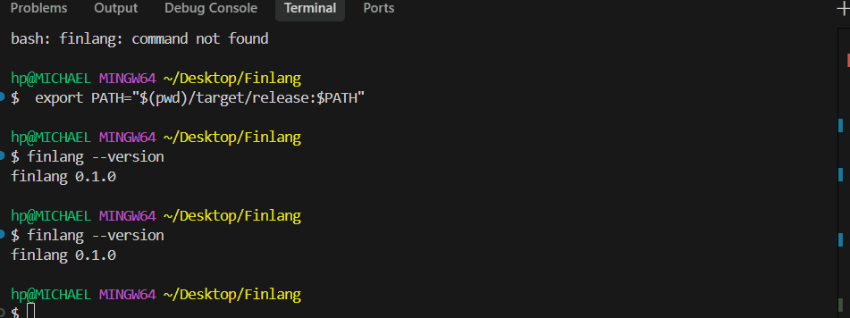
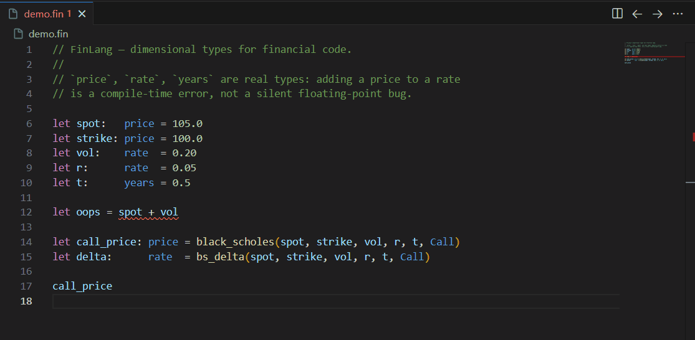

# FinLang

A statically-typed, compiled domain-specific language for financial risk
expressions. FinLang's type system models financial **dimensions** —
`price`, `rate`, `notional`, `years`, `basis_points`, `option_type` — so
that adding a price to a rate is a compile-time error rather than a silent
floating-point bug. Source code is lowered to SSA IR, optimised with
constant-folding and dead-code elimination, and compiled to native x86-64
through Cranelift in both JIT (REPL, scripting) and AOT (`.o` object file)
modes. No LLVM dependency, no garbage collector, no runtime.

```text
let spot:   price = 105.0 as price
let strike: price = 100.0 as price
let vol:    rate  = 0.20
let r:      rate  = 0.05
let t:      years = 0.5

let call_price: price = black_scholes(spot, strike, vol, r, t, Call)
let delta:      rate  = bs_delta    (spot, strike, vol, r, t, Call)
call_price
```

```text
$ finlang run examples/option_pricing.fin
result: 10.201258
```



The type system catches dimensional bugs at edit time — adding a `price`
to a `rate` is a compile-time error, surfaced live in the editor through
the bundled LSP:



## Why dimensional types

The single most common class of pricing bug — and the most expensive to
spot in production — is a silent unit mismatch: a yield treated as a
discount factor, a notional confused with a price, basis points added to a
rate without dividing by 10 000. FinLang lifts these to the type system:

```text
let x: price = 5.0 as price
let y: rate  = 0.05
x + y       // error[E001]: cannot apply `+` to `price` and `rate`
```

The rule table that drives the checker is a flat `static &[DimRule]`
array of 218 entries: every legal arithmetic combination is one row, every
illegal combination produces a tailored error message. Lookup is a linear
scan — no allocation, no hashing, no interior mutability at check time.

## Pipeline

```text
source
   │  finlang-lexer       (logos)
   ▼
tokens
   │  finlang-parser      (hand-written recursive descent)
   ▼
AST
   │  finlang-types       (dimensional rule table + scope stack)
   ▼
typed AST + expr_types
   │  finlang-ir lower    (SSA, basic blocks, phi nodes)
   ▼
SSA IR
   │  finlang-ir opt      (const_fold → dce → validate_ssa)
   ▼
optimised IR
   │  finlang-codegen     (Cranelift JIT or AOT)
   ▼
native x86-64
```

Each layer is a separate crate so the compiler can be re-used as a library
(the REPL, the LSP, integration tests, and the benchmark harness all
share the same lowering passes — there is exactly one source of truth for
FinLang semantics).

## Crates

| Crate             | Responsibility                                       |
| ----------------- | ---------------------------------------------------- |
| `finlang-lexer`   | logos-based tokeniser; `Token` + `Spanned<T>`.       |
| `finlang-parser`  | Hand-written recursive-descent parser with recovery. |
| `finlang-types`   | Dimensional analysis, 218-rule lookup, scope stack.  |
| `finlang-ir`      | SSA IR, constant folding, DCE, SSA validation.       |
| `finlang-codegen` | Cranelift JIT (`JitEngine`) + AOT (`AotEngine`).     |
| `finlang-stdlib`  | Black-Scholes, Greeks, bond pricing, IV solver.      |
| `finlang-cli`     | `finlang` driver: `repl`, `run`, `compile`, `check`. |
| `finlang-lsp`     | Language Server Protocol implementation.             |

## Standard library

| Function                                             | Returns |
| ---------------------------------------------------- | ------- |
| `black_scholes(spot, strike, vol, r, t, opt)`        | `price` |
| `bs_delta(spot, strike, vol, r, t, opt)`             | `rate`  |
| `bs_gamma(spot, strike, vol, r, t)`                  | `rate`  |
| `bs_vega(spot, strike, vol, r, t)`                   | `price` |
| `bs_theta(spot, strike, vol, r, t, opt)`             | `price` |
| `bs_rho(spot, strike, vol, r, t, opt)`               | `price` |
| `implied_vol(target_price, spot, strike, r, t, opt)` | `rate`  |
| `bond_price(face, coupon, ytm, periods)`             | `price` |
| `bond_duration(face, coupon, ytm, periods)`          | `years` |
| `pv01(face, coupon, ytm, periods)`                   | `price` |
| `discount_factor(r, t)`                              | `rate`  |

- Black-Scholes uses **continuously-compounded** rates and lognormal vol;
  `t` is in years.
- Bond functions use **annual discrete compounding**; `periods` is an
  integer count of full years.
- Greeks are returned in natural per-unit form (vega per unit vol, theta
  per year, rho per unit rate). Multiply / divide explicitly to switch to
  basis-point or per-day conventions.
- All numerics are routed through `libm` (`exp`, `log`, `sqrt`, `erf`,
  `pow`) so results are bit-reproducible across host platforms.

## Tooling

### CLI

```sh
finlang repl                      # interactive REPL (default with no args)
finlang run    file.fin           # JIT compile + execute, print result
finlang compile file.fin -o a.o   # AOT to a relocatable object file
finlang check  file.fin           # parse + typecheck only
```

The REPL supports persistent history (`~/.finlang_history`), multiline
brace-balanced input, and the following dot-commands:

| Command         | Behaviour                                     |
| --------------- | --------------------------------------------- |
| `:type <expr>`  | Print the inferred `FinType`.                 |
| `:ir <expr>`    | Print the optimised SSA IR.                   |
| `:bench <expr>` | JIT compile, run for ~1 s, report throughput. |
| `:load <path>`  | Read a file and evaluate its contents.        |
| `:help`         | Command reference.                            |
| `:quit`         | Exit the REPL (`Ctrl-D` also works).          |

### Language Server

`finlang-lsp` speaks LSP over stdio and is consumed by the bundled VS Code
extension at `editor/vscode/`. Supported requests:

- `textDocument/didOpen` / `didChange` / `didClose`
- `publishDiagnostics` — every parse error and type error mapped to a
  precise UTF-16 column range.
- `textDocument/hover` — shows the inferred `FinType` for the expression
  under the cursor.
- `textDocument/completion` — keywords, financial types, `Call`/`Put`,
  every stdlib function (with signature + short doc), and every in-file
  identifier.
- `textDocument/definition` — jumps to the matching `let` / `fn` /
  `portfolio` declaration.

### VS Code extension

```sh
cd editor/vscode
npm install
npm run compile
code --install-extension finlang-0.1.0.vsix
```

(`finlang-lsp` must be on `PATH`, or set `finlang.server.path` in the
VS Code settings.)

## Build

```sh
cargo build --release --workspace
cargo clippy  --workspace --no-deps --tests --benches -- -D warnings
cargo test    --workspace
```

All crates use `#![forbid(unsafe_code)]` except `finlang-codegen`, which
contains exactly one narrowly-scoped `unsafe` block per supported return
type (`f64`, `i64`, `i8`) where Cranelift hands us a raw `*const u8`
function pointer that must be `transmute`d before invocation. Every
`unsafe` block carries a `// SAFETY:` comment.

## Benchmarks

Captured on Windows 11 x86-64 (Cranelift 0.111). Full details and
methodology in [`benches/BENCHMARKS.md`](benches/BENCHMARKS.md).

| Bench                            | Median    | Throughput    |
| -------------------------------- | --------- | ------------- |
| `jit_run/option_pricing`         | ≈ 161 ns  | ≈ 6.2 M ops/s |
| `jit_run/var_calculation`        | ≈ 31 ns   | ≈ 32 M ops/s  |
| `jit_run/bond_portfolio`         | ≈ 1.81 µs | ≈ 553 K ops/s |
| `full_compile/option_pricing`    | ≈ 247 µs  | one-shot      |
| `native_baseline/option_pricing` | ≈ 71 ns   | ≈ 14 M ops/s  |

For the typical "Python + NumPy" reference of ≈ 5–10 µs per
Black-Scholes evaluation, FinLang's JIT at ≈ 160 ns is roughly
**30×–60× faster** end-to-end.

```sh
cargo bench --bench portfolio_bench
```

A sanity check at the top of every Criterion run asserts the JIT's
numerical output matches the safe-Rust reference to within `1e-9`.

## Examples

| Example                        | Demonstrates                                  |
| ------------------------------ | --------------------------------------------- |
| `examples/option_pricing.fin`  | Black-Scholes call + first-order Greeks.      |
| `examples/bond_portfolio.fin`  | Multi-bond PV with explicit dimensional math. |
| `examples/var_calculation.fin` | Delta-normal VaR + a `portfolio` block.       |

## Project layout

```
.
├── Cargo.toml              workspace manifest
├── README.md               this file
├── benches/
│   ├── portfolio_bench.rs  Criterion benchmark
│   └── BENCHMARKS.md       methodology + reference numbers
├── crates/
│   ├── finlang-lexer/
│   ├── finlang-parser/
│   ├── finlang-types/
│   ├── finlang-stdlib/
│   ├── finlang-ir/
│   ├── finlang-codegen/
│   ├── finlang-cli/
│   └── finlang-lsp/
├── editor/
│   └── vscode/             VS Code extension (manifest + TextMate grammar)
└── examples/               sample `.fin` programs
```

## License

APACHE 2.0.
